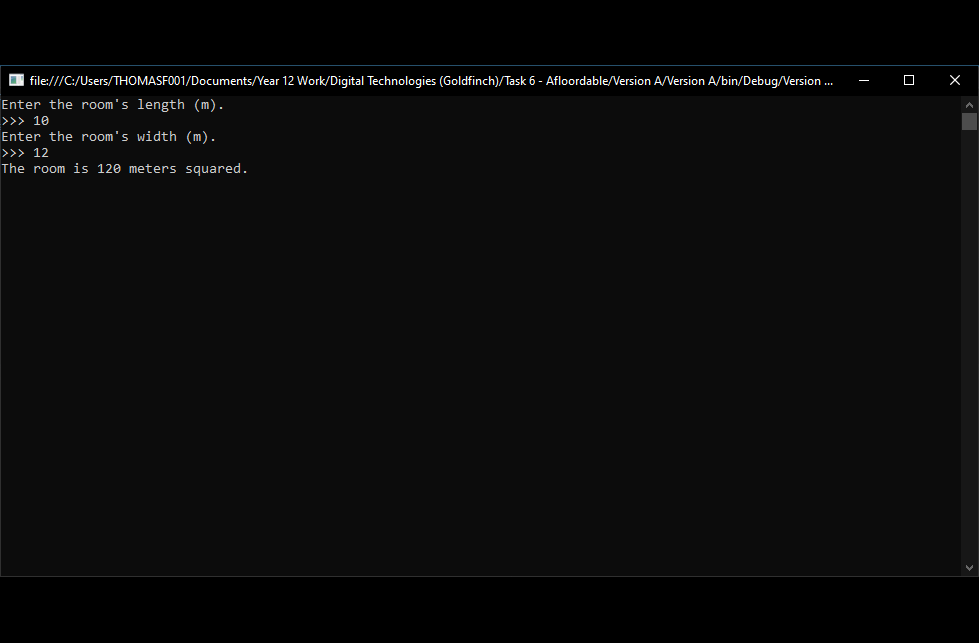

# QPacity

Running events under COVID is difficult in South Australia. Our room capacity rules are confusing, while the COVID Check-In system is inefficient and insecure. QPacity offers an alternative way to manage and attend events. 

Each user is assigned a unique QPacity Code (QR code). By presenting their code at the door of an event, users can easily sign in and out.

## Features

For event organisers, QPacity:
- Sends new users their QPacity code.
- Calculates the maximum capaity of your event, based on:
  + The event's type
  + The venue's size
  + SA's current lockdown level
- Tracks the name and phone number of all event attendees.
- Allows bisbehaving attendees to be warned or kicked out of an event, for COVID-unsafe behavior.

For event attendees, QPacity:
- Allows users to sign in/out of an event in under 2 seconds.
- Allows users to protect their privacy.
- Attend events knowing they are COVID-safe.

## Development

Learn more about how QPacity was developed [here](https://drive.google.com/file/d/1GsJYHl0uBcWPrErSAgY9MlRbsLlsmlLU/view?usp=sharing).

